> [Home](Home.md)

# O'Reilly Video - Kafka Streams with Spring Cloud Stream

- [O'Reilly Video - Kafka Streams with Spring Cloud Stream](#oreilly-video---kafka-streams-with-spring-cloud-stream)
  - [Links](#links)
  - [Chapters](#chapters)
  - [Chapter 01 Before You Begin](#chapter-01-before-you-begin)
    - [About the Course](#about-the-course)
    - [Course Prerequisite](#course-prerequisite)
    - [Setting up Your Environment](#setting-up-your-environment)
    - [Creating Your Starter Project](#creating-your-starter-project)
  - [Chapter 03 Environment Setup On MacMachine](#chapter-03-environment-setup-on-macmachine)
    - [Installing Confluent Cluster Mac](#installing-confluent-cluster-mac)
    - [Create your first Kafka Streams Project - Mac](#create-your-first-kafka-streams-project---mac)
      - [**1 Input/Output Channels**](#1-inputoutput-channels)
      - [**2 Binding interface**](#2-binding-interface)
      - [**3 Listener Service**](#3-listener-service)
  - [Chapter 04 Understanding The Technology Stack](#chapter-04-understanding-the-technology-stack)
    - [Understanding the Kafka support in Spring](#understanding-the-kafka-support-in-spring)
    - [Introduction to Spring Cloud Stream](#introduction-to-spring-cloud-stream)
    - [Introduction to Kafka Streams](#introduction-to-kafka-streams)
  - [Chapter 05 Producing Data To Kafka](#chapter-05-producing-data-to-kafka)
    - [Simple RESTFul Kakfa Producer](#simple-restful-kakfa-producer)
    - [Creating Retail POS Simulator](#creating-retail-pos-simulator)
    - [Producing JSON Messages](#producing-json-messages)
    - [Producing AVRO Messages](#producing-avro-messages)
  - [Chapter 06 Processing Kafka Streams](#chapter-06-processing-kafka-streams)
    - [Real-Time Stream Processing Requirement](#real-time-stream-processing-requirement)
      - [**Shipment service**](#shipment-service)
      - [**Loyalty service**](#loyalty-service)
      - [**Trend service**](#trend-service)
      - [**Combined diagram Requirement**](#combined-diagram-requirement)
      - [**Combined diagram Impl**](#combined-diagram-impl)
      - [**Tech requirement**](#tech-requirement)
    - [Processing JSON Message Stream](#processing-json-message-stream)
      - [**Step 1 input/output channels**](#step-1-inputoutput-channels)
      - [**Step 2 Binding interface**](#step-2-binding-interface)
      - [**Step 3 Create services**](#step-3-create-services)
    - [Processing AVRO Message Stream](#processing-avro-message-stream)
      - [**Step 1 Data Model**](#step-1-data-model)
      - [**Step 2 Data Tranformation Services**](#step-2-data-tranformation-services)
      - [**Step 3 Kafka Listeners**](#step-3-kafka-listeners)
      - [**Step 4 Kafka Channels and Stream Binder**](#step-4-kafka-channels-and-stream-binder)
    - [Over all flow](#over-all-flow)
    - [Understanding Record Serialization and Deserialization](#understanding-record-serialization-and-deserialization)
    - [KStream Methods](#kstream-methods)
  - [Chapter 7 : Working with KStream](#chapter-7--working-with-kstream)
    - [Kafka Streams Exactly Once implementation](#kafka-streams-exactly-once-implementation)
    - [Implement Exactly Once](#implement-exactly-once)
    - [Let's Practice - a comlex problem statement](#lets-practice---a-comlex-problem-statement)
    - [Working with XML](#working-with-xml)
    - [Handling Errors and Exceptions](#handling-errors-and-exceptions)
    - [Mixed branching of a KStream](#mixed-branching-of-a-kstream)
    - [Handling Poisson Pills](#handling-poisson-pills)
  - [Chapter 8: KTable and Aggregation](#chapter-8-ktable-and-aggregation)
    - [Introduction to KTable](#introduction-to-ktable)
    - [Deep Dive into KTable](#deep-dive-into-ktable)
    - [Computing Streaming Aggregates](#computing-streaming-aggregates)
    - [Aggregate Concepts](#aggregate-concepts)
    - [Reducing a Kafka Stream](#reducing-a-kafka-stream)
    - [Aggregating a Kafka Stream](#aggregating-a-kafka-stream)
    - [Aggregation Challenges](#aggregation-challenges)
    - [KTable Aggregation](#ktable-aggregation)
  - [Chapter 9 : Timestamp and Windowing Aggregates](#chapter-9--timestamp-and-windowing-aggregates)
  - [Chapter 10 : Joins in Kafka Streams](#chapter-10--joins-in-kafka-streams)
    - [KStream-KStream Joins](#kstream-kstream-joins)
      - [A payment cycle flow chart](#a-payment-cycle-flow-chart)
      - [A payment cycle sequence diagram](#a-payment-cycle-sequence-diagram)
      - [Payment Request table](#payment-request-table)
      - [Payment Confirmation table](#payment-confirmation-table)
      - [The process method of Listener](#the-process-method-of-listener)
    - [KStream-KTable joins](#kstream-ktable-joins)
    - [KStream to KTable joins](#kstream-to-ktable-joins)
    - [Implementing complex Aggregation](#implementing-complex-aggregation)
    - [Stream Listener Manual testing](#stream-listener-manual-testing)
    - [Stream Listener Unit testing](#stream-listener-unit-testing)

## Links

- [OReily Course Link](https://learning.oreilly.com/videos/kafka-streams-with/9781801811422/)
- [Issue #3 Kafka](https://github.com/rumq/kafka/issues/3)

## Chapters

## Chapter 01 Before You Begin

### About the Course

### Course Prerequisite

### Setting up Your Environment

- JDK 11
- Kafka Cluster
- Spring Initializr

2 Flavours of Kafka clusters

- Apache Kafka
- Confluent Kafka -> Comes with Schema Registry which is used to store the schema of the messages.

### Creating Your Starter Project

Use Spring Initializr to create a project with the following dependencies

- Maven or Gradle
- Spring Boot 2.4.0
- Group `net.rumq.kafka.examples`
- Artifact `hellostreams`
- Packaging `jar`
- Java 11
- Dependencies
  - Spring Cloud Stream
  - Spring for Apache Kafka
  - Lombok

IntelliJ

- Open and pick `build.gradle` file
- Comment testImplementation 'org.springframework.cloud:spring-cloud-stream-test-support'
- Install Lombok plugin (It was bundled in mine already)
- Setting-> Build, Execution, Deployment -> Compiler -> Annotation Processors -> Enable annotation processing
- Setting -> Build, Execution, Deployment -> Build Tools -> Gradle
  - -> Gradle JVM -> JAVA_HOME
  - -> Build and run using -> IntelliJ IDEA

## Chapter 03 Environment Setup On MacMachine

### Installing Confluent Cluster Mac

Use docker compose to install confluent cluster

### Create your first Kafka Streams Project - Mac

Creating a listener on a topic that is a message consumer that consumes messages on the topic and logs the message.

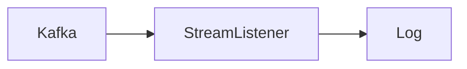

#### **1 Input/Output Channels**

Change the `application.properties` to `application.yaml`

Paste the following in `application.yaml`

```yaml
spring:
  cloud:
    stream:
      # A) input/output channel (for Sprping Cloud Stream)
      bindings:
        input-channel-1: # name of the channel
          destination: users # name of the topic
      # B) binder configuration (for Kafka Streams)
      kafka:
        streams:
          binder:
            applicationId: hellostreams
            brokers: localhost:9092 # kafka cluster
            configuration:
              default:
                key:
                  serde: org.apache.kafka.common.serialization.Serdes$StringSerde # key serializer
                value:
                  serde: org.apache.kafka.common.serialization.Serdes$StringSerde # value serializer
```

Everything under `spring.cloud.stream` hierarchy

Input/Output channel binders under `bindings`.

And binders under `kafka.streams.binder` which defines technical details of the binder. Amazon Kinesis, Apache Kafka, RabbitMQ, etc.

We are using _Apache kafka streams binder_, which is a Kafka Streams binder implementation for Spring Cloud Stream. It provides a binder implementation for Kafka Streams. There is also _Apache Kafka binder_ for the non-streaming use case.

#### **2 Binding interface**

A listener binding interface to define the input and output bindings.

```java
public interface KafkaListenerBinding {
  @Input("input-channel-1")
  KStream<String, String> inputStream();
}
```

`Input` annotation is deprecated.

Change gradle to use the current Spring Cloud GA version from [here](https://spring.io/projects/spring-cloud#learn).

```groovy
ext {
	set('springCloudVersion', "Hoxton.SR8")
}
```

#### **3 Listener Service**

For the service,

Annotate as `@Service`, enable the binding interface as `@EnableBinding` and add a `@StreamListener` to the method that will process the messages.

```java
@Log4j2
@Service
@EnableBinding(KafkaListenerBinding.class)
public class KafkaListenerService {

    @StreamListener("input-channel-1")
    public void process(KStream<String, String> input) {
        input.foreach((k,v) -> log.info(String.format("Key: %s, Value: %s",k,v)));
    }
}
```

## Chapter 04 Understanding The Technology Stack

### Understanding the Kafka support in Spring

Kafka has two APIs - client and stream API.

Client API is for producers and consumers.

Stream API is for stream processing.

Spring has two projects for Kafka.

The first is [Spring for Apache Kafka](https://spring.io/projects/spring-kafka), which is a subproject of Spring Boot. It provides a Spring Boot starter for Apache Kafka. It uses the Kafka client API. This is used when you want to connect Kafka to other systems.

The second is [Spring Cloud Stream](https://spring.io/projects/spring-cloud-stream), which is a subproject of Spring Cloud. It has two binder implementations

- Apache Kafka binder (old) - uses Kafka client API
- Apache Kafka Streams binder (new) - uses Kafka stream API

The Kafka Streams binder is used in cases where the input and output are Kafka topics, and Kafka binder is used when you want to connect Kafka to other systems.

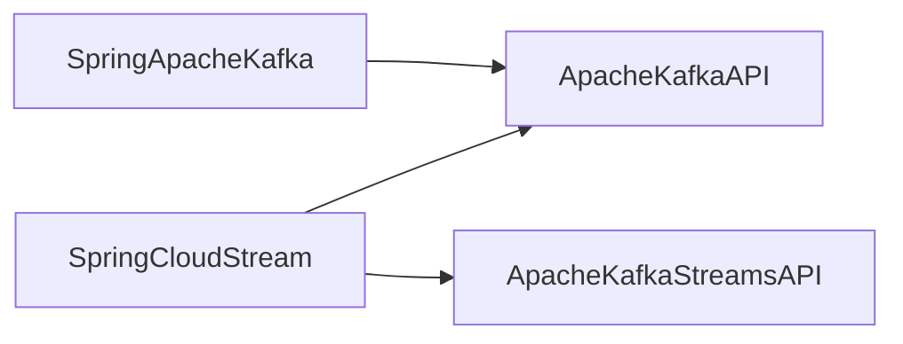

### Introduction to Spring Cloud Stream

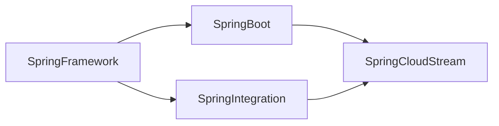

Spring Cloud Stream is a framework for building message-driven microservices. It provides a programming model for building event-driven microservices that connect to message brokers. It provides a uniform way to configure message brokers and connect to them. It also provides a way to connect to other systems.

Spring Cloud Streams - Applications Archtecture

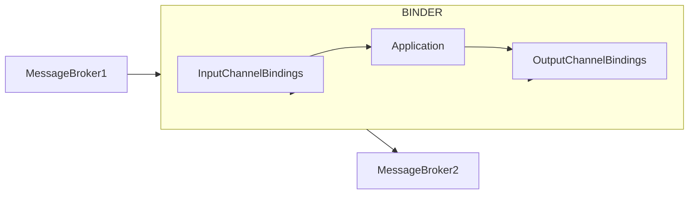

### Introduction to Kafka Streams

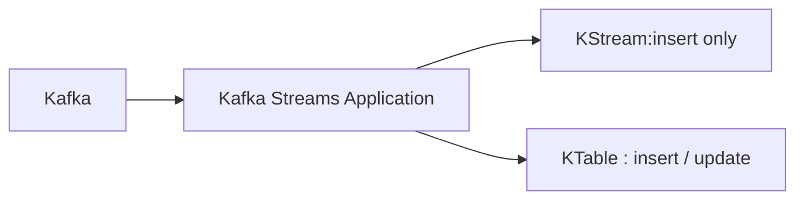

Kafka Streams is a [Java library](https://javadoc.io/doc/org.apache.kafka/kafka-streams/latest/index.html) for building real-time applications and microservices, where the input and output data are stored in Kafka clusters. It is a client library for Kafka. It is used to process streams of data. It is a library for building stream processing.

## Chapter 05 Producing Data To Kafka

### Simple RESTFul Kakfa Producer

I created this example. There is no code in the course repo for this.

See [Kafkaproducer](Kafkaproducer.md)

### Creating Retail POS Simulator

### Producing JSON Messages

[JsonPosGeneratorApplication](https://github.com/rumq/Kafka-Streams-with-Spring-Cloud-Stream/blob/main/jsonposgen/src/main/java/guru/learningjournal/examples/kafka/jsonposgen/JsonPosGeneratorApplication.java#:~:text=services-,JsonPosGeneratorApplication,-.java)

**Adding logic to Spring Application**

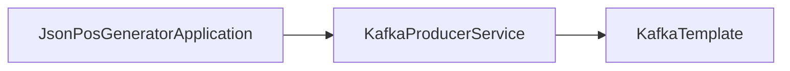

Override run method to produce messages

```java
    @Override
    public void run(ApplicationArguments args) throws Exception {

        for (int i = 0; i < INVOICE_COUNT; i++) {
            producerService.sendMessage(invoiceGenerator.getNextInvoice());
            Thread.sleep(1000);
        }
    }
```

**Datamodel**

Using Jackson to convert POJO to JSON. Creating a JSON friendly class

```java
@Data
@JsonInclude(JsonInclude.Include.NON_NULL)
public class PosInvoice {

    @JsonProperty("InvoiceNumber")
    private String invoiceNumber;
    @JsonProperty("CreatedTime")
    private Long createdTime;
    private Double totalAmount;
    private Integer numberOfItems;
    @JsonProperty("DeliveryAddress")
    private DeliveryAddress deliveryAddress;
    @JsonProperty("InvoiceLineItems")
    private List<LineItem> invoiceLineItems = new ArrayList<LineItem>();
}
```

**Producer template configuration**

Adding Serializers to application.yaml

```yaml
spring:
  kafka:
    producer:
      client-id: json-pos-simulator
      bootstrap-servers: localhost:9092
      key-serializer: org.apache.kafka.common.serialization.StringSerializer
      value-serializer: org.springframework.kafka.support.serializer.JsonSerializer
      properties:
        spring.json.add.type.headers: false

application:
  configs:
    invoice.count: 60
    topic.name: pos-topic
```

### Producing AVRO Messages

See [AvroPosGeneratorApplication](https://github.com/rumq/Kafka-Streams-with-Spring-Cloud-Stream/blob/main/avroposgen/src/main/java/guru/learningjournal/examples/kafka/avroposgen/AvroPosGeneratorApplication.java)

**Datamodel**

_Include Avro package_

Use maven dependency to add Avro and Kafka Avro Serializer

```xml
<dependency>
  <groupId>org.apache.avro</groupId>
  <artifactId>avro</artifactId>
  <version>1.9.2</version>
</dependency>
<dependency>
  <groupId>io.confluent</groupId>
  <artifactId>kafka-avro-serializer</artifactId>
  <version>6.0.0</version>
</dependency>
```

_Add the Maven AVRO Plugin_

Use maven plugin to generate Avro friendly class. Add's a phase `generate-sources` to the build lifecycle. Specify the source directory and output directory. Specify the imports. Specify the string type.

```xml
<plugin>
<groupId>org.apache.avro</groupId>
<artifactId>avro-maven-plugin</artifactId>
<version>1.8.2</version>
<executions>
	<execution>
		<phase>generate-sources</phase>
		<goals>
			<goal>schema</goal>
		</goals>
		<configuration>
			<sourceDirectory>src/main/avro</sourceDirectory>
			<outputDirectory>${project.build.directory}/generated-sources</outputDirectory>
			<imports>
				<import>${project.basedir}/src/main/avro/LineItem.avsc</import>
				<import>${project.basedir}/src/main/avro/DeliveryAddress.avsc</import>
			</imports>
			<stringType>String</stringType>
		</configuration>
	</execution>
</executions>
</plugin>
```

_Create Avro Schema_

The schema looks like the below. The imports are reference to another class, which has to be imported in pom generate source configuration

```json
{
  "namespace": "guru.learningjournal.examples.kafka.model",
  "type": "record", # Type of the class
  "name": "PosInvoice", # Name of the class
  "fields": [
    {"name": "InvoiceNumber","type": ["null","string"]},
    {"name": "CreatedTime","type": ["null","long"]},
    {"name": "TotalAmount","type": ["null","double"]},
    {"name": "NumberOfItems","type": ["null","int"]},
    {"name": "DeliveryAddress","type": ["null","DeliveryAddress"]}, # import
    {"name": "InvoiceLineItems","type": {"type": "array", "items": "LineItem"}} # import
  ]
}
```

Execute `compile` of maven to generate the classes.

```yaml
spring:
  kafka:
    producer:
      client-id: avro-pos-simulator # Different client id
      bootstrap-servers: localhost:9092
      key-serializer: org.apache.kafka.common.serialization.StringSerializer # Same as JSON example
      value-serializer: io.confluent.kafka.serializers.KafkaAvroSerializer # Avro Serializer not JSON
      properties:
        schema.registry.url: http://localhost:8081 # Schema Registry URL

application:
  configs:
    invoice.count: 60
    topic.name: avro-pos-topic # Different topic name
```

**Producer template configuration**

`kafka-avro-serializer` comes from a different maven repository. Add the repository to the pom

```xml
<repositories>
    <repository>
        <id>confluent</id>
        <name>Confluent</name>
        <url>https://packages.confluent.io/maven/</url>
    </repository>
</repositories>
```

## Chapter 06 Processing Kafka Streams

### Real-Time Stream Processing Requirement

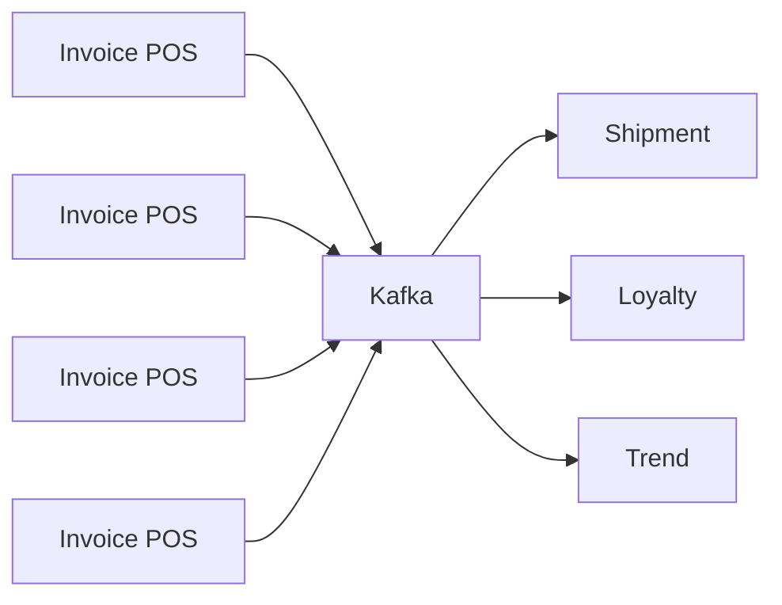

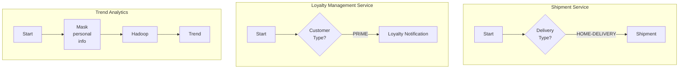

#### **Shipment service**

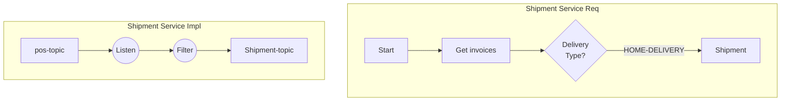

#### **Loyalty service**

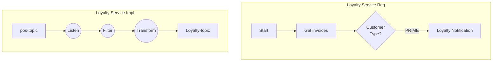

#### **Trend service**

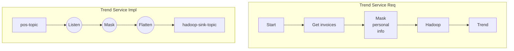

#### **Combined diagram Requirement**

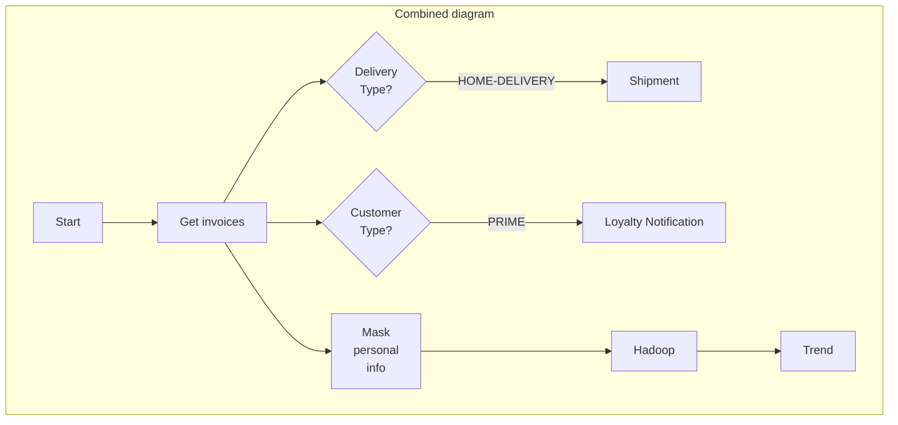

#### **Combined diagram Impl**

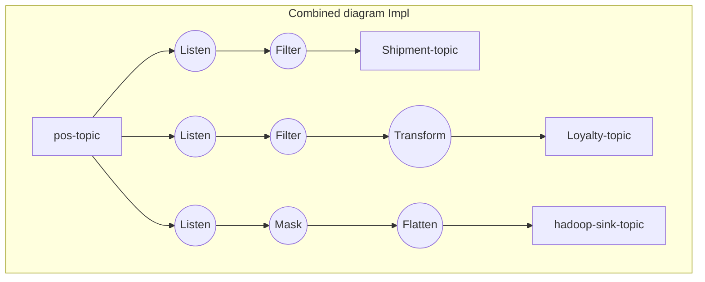

We need three listeners because we are sending three different messages to three different receivers.

#### **Tech requirement**

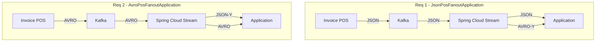

### Processing JSON Message Stream

The JsonPosFanoutApplication is not in the repo.

Create the project using SB 2.4.0, Java 11 and following dependencies

- Cloud Stream
- Spring for Apache Kafka
- Lombok

We are using Streams API not the Producer API

We need two additional dependencies.

```xml
<dependency>
    <groupId>org.apache.avro</groupId>
    <artifactId>avro</artifactId>
    <version>1.9.2</version>
</dependency>
<dependency>
    <groupId>io.confluent</groupId>
    <artifactId>kafka-streams-avro-serde</artifactId>
    <version>6.0.0</version>
</dependency>
<dependency>
    <groupId>io.confluent</groupId>
    <!-- We are using Streams API, so use serde -->
    <artifactId>kafka-streams-json-schema-serde</artifactId>
    <version>6.0.0</version>
</dependency>
```

Add maven plugin for avro code generation

Create the following transformer classes

```java

Notification getNotification(PosInvoice posInvoice);

PosInvoice getMaskedInvoice(PosInvoice posInvoice);

List<HadoopRecord> getHadoopRecords(PosInvoice posInvoice);
```

The three steps of Stream processing :-

#### **Step 1 input/output channels**

For input/output channels and binding, note the following

```yaml
spring:
  cloud:
    stream:
      bindings:
        notification-input-channel:
          destination: pos-topic
        notification-output-channel:
          destination: loyalty-topic
        hadoop-input-channel:
          destination: pos-topic
        hadoop-output-channel:
          destination: hadoop-sink-topic
      kafka:
        streams:
          binder:
            brokers: localhost:9092
            configuration:
              schema.registry.url: http://localhost:8081
          bindings:
            notification-output-channel:
              producer:
                valueSerde: io.confluent.kafka.streams.serdes.avro.SpecificAvroSerde
            hadoop-output-channel:
              producer:
                valueSerde: io.confluent.kafka.streams.serdes.avro.SpecificAvroSerde
```

#### **Step 2 Binding interface**

```java
public interface PosListenerBinding {

    @Input("notification-input-channel")
    KStream<String, PosInvoice> notificationInputStream();

    @Output("notification-output-channel")
    KStream<String, Notification> notificationOutputStream();

    @Input("hadoop-input-channel")
    KStream<String, PosInvoice> hadoopInputStream();

    @Output("hadoop-output-channel")
    KStream<String, HadoopRecord> hadoopOutputStream();

}
```

#### **Step 3 Create services**

_NotificationProcessorService_

```java

@Service
@Log4j2
@EnableBinding(PosListenerBinding.class)
public class NotificationProcessorService {

    @Autowired
    RecordBuilder recordBuilder;

    @StreamListener("notification-input-channel")
    @SendTo("notification-output-channel")
    public KStream<String, Notification> process(KStream<String, PosInvoice> input) {

        KStream<String, Notification> notificationKStream = input
                .filter((k , v) -> v.getCustomerType().equals(CustomerType.PRIME))
                .mapValues( v -> recordBuilder.getNotification(v));


        notificationKStream.foreach((k, v) -> log.info(String.format("Notifiation :- Key: %s, Value: %s", k, v)));

        return notificationKStream;
    }
}

```

_HadoopRecordProcessorService_

```java
@Service
@Log4j2
@EnableBinding(PosListenerBinding.class)
public class HadoopRecordProcessorService {

    @Autowired
    RecordBuilder recordBuilder;

    @StreamListener("hadoop-input-channel")
    @SendTo("hadoop-output-channel")
    public KStream<String, HadoopRecord> process(KStream<String, PosInvoice> input) {

        KStream<String, HadoopRecord> hadoopRecordKStream = input
                .mapValues( v -> recordBuilder.getMaskedInvoice(v))
                .flatMapValues( v -> recordBuilder.getHadoopRecords(v));

        hadoopRecordKStream.foreach((k, v) -> log.info(String.format("Hadoop Record:- Key: %s, Value: %s", k, v)));

        return hadoopRecordKStream;
    }
}


```

### Processing AVRO Message Stream

[AvroPosFanoutApplication](https://github.com/rumq/Kafka-Streams-with-Spring-Cloud-Stream/blob/main/avroposfanout/src/main/java/guru/learningjournal/examples/kafka/avroposfanout/AvroPosFanoutApplication.java)

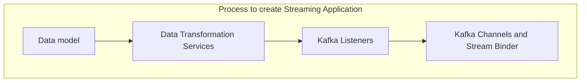

#### **Step 1 Data Model**

Create avro friendly models `LineItem`, `DeliveryAddress` and `PosInvoice` in the `model` package, following this:

1. Create AVRO schema for each model
2. Include AVRO dependency in pom.xml
3. Include AVRO maven plugin in pom.xml
4. Compile the project using Maven.

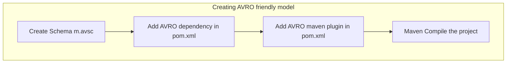

#### **Step 2 Data Tranformation Services**

Create `NotificationProcessorService` and `HadoopRecordProcessorService` in the `service` package.

#### **Step 3 Kafka Listeners**

Create `PosListenerBinding` in the `binding` package.

#### **Step 4 Kafka Channels and Stream Binder**

Update the `application.yml` file with the channel and stream binder configuration.

### Over all flow

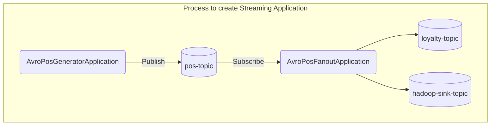

### Understanding Record Serialization and Deserialization

Spring Cloud Stream and Kafka Streams can both be used for serialization and deserialization of records.

The following setting is used to configure the serialization and deserialization of records. If `nativeDecoding` is set to `true`, then Kafka is used for serialization and deserialization. If `nativeDecoding` is set to `false`, then Spring Cloud Stream is used for serialization and deserialization. The default value is `true`. This is recommended.

```yaml
spring:
  cloud:
    stream:
      bindings:
        notification-output-channel: # or output channel name
          nativeDecoding: true # uses Kafka, false uses Spring Cloud Stream
```

Serde stands for Serializer and Deserializer. Serde is used to serialize and deserialize the records.

Example classes in the serde package

`org.apache.kafka.common.serialization.Serdes`

- `StringSerde`
- `IntegerSerde`
- `LongSerde`
- `DoubleSerde`
- `FloatSerde`
- `ByteArraySerde`
- `BytesSerde`
- `ShortSerde`

For Custom Objects, we have two options. We can either use custom serde classes or use Serde classes provided by Confluent. It is preferable to use Confluent Serde classes.

For Avro objects, we can use `SpecificAvroSerde` and for JSON objects, we can use `KafkaJsonSchemaSerde`.

Serde sequence of search

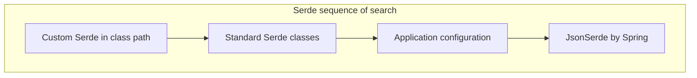

### KStream Methods

See [KStream API](https://kafka.apache.org/26/javadoc/org/apache/kafka/streams/kstream/KStream.html)

Methods table

| Method          | Description                                                           |
| --------------- | --------------------------------------------------------------------- |
| `filter`        | Filters the records based on the predicate                            |
| `filterNot`     | Filters the records based on the predicate                            |
| `map`           | Maps the records to a new value                                       |
| `mapValues`     | Maps the values of the records to a new value                         |
| `flatMap`       | Maps the records to a new value and flattens the result               |
| `flatMapValues` | Maps the values of the records to a new value and flattens the result |
| `selectKey`     | Maps the records to a new key                                         |
| `peek`          | Performs an action on each record                                     |
| `foreach`       | Performs an action on each record                                     |
| `branch`        | Branches the records based on the predicate                           |
| `groupBy`       | Groups the records based on the key selector                          |
| `groupByKey`    | Groups the records based on the key                                   |
| `join`          | Joins the records with another stream                                 |
| `leftJoin`      | Left joins the records with another stream                            |
| `outerJoin`     | Outer joins the records with another stream                           |
| `merge`         | Merges the records with another stream                                |
| `through`       | Sends the records to a topic                                          |
| `foreach`       | Performs an action on each record                                     |
| `branch`        | Branches the records based on the predicate                           |
| `selectKey`     | Maps the records to a new key                                         |
| `To`            | Sends the records to a topic                                          |
| `ToTable`       | Sends the records to a topic and creates a table                      |
| `ToStream`      | Sends the records to a topic and creates a stream                     |

## Chapter 7 : Working with KStream

### Kafka Streams Exactly Once implementation

Scenario

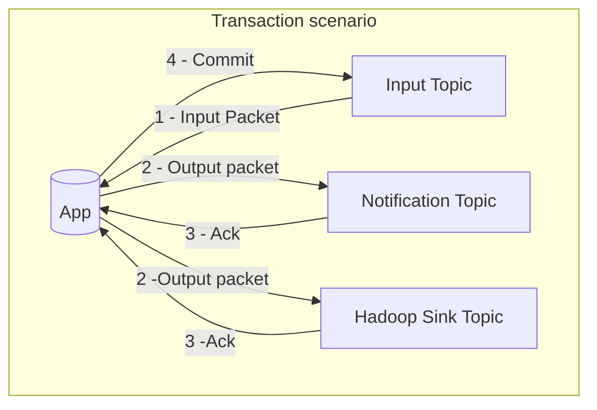

If the transaction fails at any point, the transaction should be rolled back.
Failures can happen when

1. Notification ack is not received and the application retries it, leading to duplicate notification.
2. Application fails after sending the notification and and hadoop sink, but before doing the commit. It may reprocess the message, leading to duplicates in both notification and hadoop sink.

How to do this in a single atomic transaction?

### Implement Exactly Once

In `application.yml` file, set `spring.cloud.stream.kafka.streams.binder.configuration.processing.guarantee` to `exactly once`.

Use a single listener.

```java
@StreamListener("inputChannel")
public void process(KStream<Object, PosInvoice> input) {
  input
    .peek((key, value) -> log.info("Notification: {}", value))
    .to("notificationTopic");
  input
    .peek((key, value) -> log.info("Hadoop: {}", value))
    .to("hadoopTopic");
}
```

Note that there is no need to define output channel in the `application.yml` file. This is because the sending is done by the Kafka Streams API. All of the above is done in a single transaction as long as the `processing.guarantee` is set to `exactly once`.

### Let's Practice - a comlex problem statement

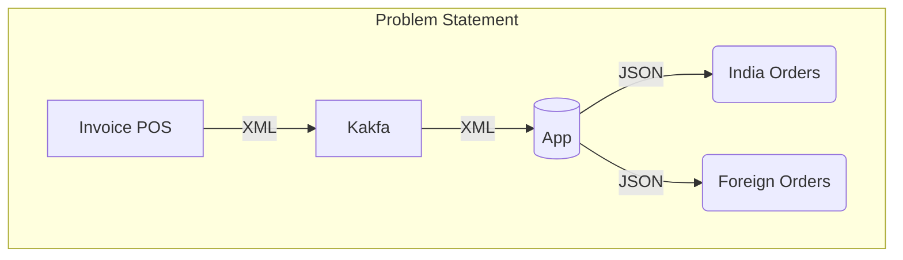

1. Incoming message is in XML which does not have a serializer.
2. Handle errors and exceptions.
3. Do this as exactly once.
4. Valid orders should have Order id key.
5. Invalid orders should have error key.

### Working with XML

JSON, Avro and Protocol Buffers the modern formats used. There is no inbuilt support for XML in Kafka Streams. We need to use a custom serializer and deserializer.

We'll use JAXB for generating the data model from the XML schema. Similar to Avro processing, we'll use a maven plugin to generate the data model.

```xml
<plugin>
  <groupId>org.jvnet.jaxb2.maven2</groupId>
  <artifactId>maven-jaxb2-plugin</artifactId>
  <version>0.14.0</version>
  <executions>
    <execution>
      <id>xjc</id>
      <goals>
        <goal>xjc</goal>
      </goals>
    </execution>
  </executions>
  <configuration>
    <schemaDirectory>${project.basedir}/src/main/resources/schema</schemaDirectory>
    <outputDirectory>${project.basedir}/src/main/java</outputDirectory>
    <packageName>com.example.demo.model</packageName>
  </configuration>
</plugin>
```

And use a XML Schema.

The above example was generated by CoPilot. The course git repo did not have the example.

### Handling Errors and Exceptions

The example `xmlorder` is not available in the course git repo.

```mermaid
flowchart TD
  subgraph "Error Handling"
    direction LR
    I[input topic] --> |Input | M((map))
    M --> |Tagged orders| F1((filter))
    F1 --> |Valid | V((branch))
    M --> |Tagged orders | F2((filter))
    F2 --> |Error | E[invalid topic]
    V --> L(India Order)
    V --> FO(Foreign Order)
  end
```

### Mixed branching of a KStream

### Handling Poisson Pills

If JSON serialization has failed, we have three options

1. logAndFail
2. logAndContinue
3. sendToDlq

It is set in `application.yml` file.

```yaml
# logAndFail, is the default
spring.cloud.stream.kafka.streams.binder.configuration.default.deserializationExceptionHandler: logAndFail # logAndContinue, sendToDlq
```

The dlq is specified under valueSerde

```yaml
bindings
  inputChannel:
    consumer:
      valueSerde: io.confluent.kafka.streams.serdes.json.KafkaJsonSchemaSerde
        dlqName: topic-1-dlq
  input-channel-2:
    consumer:
      valueSerde: io.confluent.kafka.streams.serdes.json.KafkaJsonSchemaSerde
        dlqName: topic-2-dlq
```

## Chapter 8: KTable and Aggregation

### Introduction to KTable

Properties of a KTable

1. KTable has a primary key
2. KTable cannot have a null key
3. KTable implements a UPSERT
4. Null key implements a DELETE

Most of KStream operations are available for KTable.

### Deep Dive into KTable

See

- [KTableDemoApplication](ktabledemo/KTableDemo.md)

```mermaid
flowchart TD
  subgraph "KTable Processing"
    direction LR
    I[stock-tick-topic] --> |Input | K[Kafka]
      K --> F[Framework - KTable]
    subgraph "Inner"
      direction LR
      F --> |Filter| L[Listener - KTable]
      L --> K1[KStream]
    end
    K1 --> P[Print]
  end
```

The `application.yml` file has the following configuration.

```yaml
kafka.streams:
  binder:
  configuration:
    commit.interval.ms: 1000 # default 30000, wait for this time before committing
    state.dir: state-store # location of the state store
  bindings:
    stock-input-channel:
      consumer:
        materializedAs: stock-tick-store # name of the state store
```

The messages being stored in the Initial KTable will be overwritten by the new messages, if the key is the same.

At the end of the commit interval, the state store is flushed to disk. The state store is a RocksDB instance.

KTable helps us process the most recent data. It is a changelog stream.

A KTable can be converted into a KStream using `toStream()` method. This is done to call methods that are not available in KTable. For example, `foreach()`. A KTable cannot be sent to a topic, so we need to convert it to a KStream, if we want to send it to a topic.

### Computing Streaming Aggregates

See

- [aggregationdemo](https://github.com/rumq/Kafka-Streams-with-Spring-Cloud-Stream/tree/main/streamingaggregates)
- [StreamingAggregates](streamingaggregates/StreamingAggregates.md)

Problem Statement

```mermaid
flowchart TD
  subgraph "Problem Statement"
    direction LR
    I[topic] --> |Input | K[Kafka]
    K --> F[Framework - KTable]
    subgraph "Inner"
      direction LR
      F --> |Filter| L[Listener - KTable]
      L --> K1[KStream]
    end
    K1 --> P[Print]
  end
```

As we are using `groupBy` without the `Key`, internal repartitioning will happen.

```java
    public void process(KStream<String, String> input) {

        // Split the input stream into words (KStream<String, String>)
        KStream<String, String> wordStream = input
                .flatMapValues(value -> Arrays.asList(value.toLowerCase().split(" ")));


        // Grouping has to happen before aggregation.
        // Count the words (KTable<String, Long>)
        wordStream.groupBy((key, value) -> value)  // KGroupedStream<String, String>
                .count()  // KTable<String, Long>
                .toStream()  // KStream<String, Long>
                .peek((k, v) -> log.info("Word: {} Count: {}", k, v)); // KStream<String, Long>
    }

```

### Aggregate Concepts

1. Aggregation Key
2. Aggregation applies to KStream and KTable
3. Aggregation is only available after grouping

```shell
KStream -> groupBy(), groupByKey() -> KGroupedStream -> aggregate() -> KTable
KTable  -> groupBy()               -> KGroupedTable -> aggregate() -> KTable
```

Aggregation formula

1. count()
2. reduce()
3. aggregate()

Every Kafka Streams application is distributed and multi-threaded, by default.

The framework creates a thread for each partition.

The data is partitioned by the key. This means that all the data for a particular key will arrive at the same partition. The data is processed by the thread that is assigned to the partition.

All the threads form a consumer group.

Every application has a unique and static application id. It is used to identify the consumer group. This is used to identify the consumers in the consumer group.

Each thread in the consumer group is assigned a unique id and prefixed with the application id.

The below diagram shows 3 partitions on a Kafka cluster being read by 3 threads on a single machine.

```mermaid
flowchart TD
  subgraph "Aggregation"
    direction LR
    subgraph "Kafka Cluster"
      direction LR
      P1(Partition 1)
      P2(Partition 2)
      P3(Partition 3)
    end
    I[topic] --> |Input | A1A
    subgraph "Application 1 - Machine A"
      direction LR
      A1A[APP-01] --> L1CG1
      A1A --> L1CG2
      A1A --> L1CG3
    end
  end
```

The below shows what happens when the application is scaled to 2 machines. The application will have the the same application id. The third consumer consuming from the third partition is assigned to the second machine, and it is shutdown on the first machine.

Always there is only one thread reading from a single partition. If there are more threads or machines, they'll have to wait.

```mermaid
flowchart TD
  subgraph "Aggregation"
    direction LR
    I[topic] --> |Input | A1A
    I[topic] --> |Input | A2A
    subgraph "Application 1 - Machine A"
      direction LR
      A1A[APP-01] --> L1CG1
      A1A --> L1CG2
    end
    subgraph "Application 1 - Machine B"
      direction LR
      A2A[APP-01] --> L1CG3
    end
  end
```

As an example, if we have three partitions, and three keys STR1, STR2, STR3, it's possible that they are distributed across the three partitions. If we have three threads, then each thread will be assigned a partition. The data for STR1 will be processed by thread 1, STR2 by thread 2, and STR3 by thread 3. If we use `groupByKey`, then each thread is able to calculate the aggregate for each key.

But, if we want to aggregate by a different key say customer id, then these may be distributed across the partitions, and therefore the threads will not be able to calculate the aggregate for each customer id. In this case, we can use `groupBy` to group the data by the customer id. Then the framework will create an internal topic with the same number of partitions as the input topic. The data will be repartitioned by the customer id. This will ensure that all the data for a particular customer id will be in the same partition. This will ensure that the threads will be able to calculate the aggregate for each customer id.

This will of course be an expensive operation, so we have to design the keys well in advance, so this repartitioning is not required.

Kafka streams API has key preserving and key changing operations. The below table shows the corresponding operations of each type.

| Key Preserving Operations | Key Changing Operations |
| ------------------------- | ----------------------- |
| `mapValues()`             | `map()`                 |
| `flatMapValues()`         | `flatMap()`             |
| `transformValues()`       | `transform()`           |
| `groupByKey()`            | `groupBy()`             |

### Reducing a Kafka Stream

See [Rewards](chapter-08-ktable-aggregration/rewards/Rewards.md)

Computing `TotalLoyaltyPoints` for a customer which will require adding up all the `EarnedLoyaltyPoints`. We can use `reduce()` to do this as there is no `sum()` method.

We will be looking at _rewards_ demo.

### Aggregating a Kafka Stream

See

- [StreamingAggregates](chapter-08-ktable-aggregration/streamingaggregates/StreamingAggregates.md)

### Aggregation Challenges

- [KStreamAggregate](chapter-08-ktable-aggregration/kstreamaggregate/KStreamAggregate.md)

### KTable Aggregation

-[KTableDemo](chapter-08-ktable-aggregration/ktabledemo/KTableDemo.md) -[KTableAggregate](chapter-08-ktable-aggregration/ktableaggregate/KTableAggregate.md)

## Chapter 9 : Timestamp and Windowing Aggregates

See

- [TimestampExtractor](https://kafka.apache.org/31/javadoc/org/apache/kafka/streams/processor/TimestampExtractor.html) interface documentation for list of timestamp extractors.
- [WindowCount](chapter-09-timestamp-and-windowing-aggregates/windowcount/WindowCount.md)
- [SessionWindow](chapter-09-timestamp-and-windowing-aggregates/sessionwindow/SessionWindow.md)

## Chapter 10 : Joins in Kafka Streams

Conditions for a join :

1. KStream/KTable to be joined should have a valid key
2. All topics should have the same number of partitions
3. Data in the topics should be partitioned by the same key (Co-partitioned)
4. Co-partitioning is not required if the join is a KStream-GlobalKTable join
5. Non-key based joins are allowed with KStream-GlobalKTable joins
6. KStream must be on the left side of the join

### KStream-KStream Joins

KStream-KStream joins are always windowed.

#### A payment cycle flow chart

```mermaid
flowchart
  subgraph "Payment Cycle"
    subgraph "Kafka"
     KA[Kafka App] --> | Pay Req| T1[reqest-topic]
     KA --> | Pay Conf| T2[confirm-topic]
    end
  U[User] --> |1 Pay Req| S[Site]
    S --> |2 Pay Req| W[Wallet]
    W --> |3 Pay Req| K[Kafka App]
    W --> |4 Tran Id| S
    W --> |5 OTP | U
    U --> |6  OTP | S
    S --> |7 OTP | W
    W --> |8 Pay Conf| K
  end
```

#### A payment cycle sequence diagram

Here is the sequence diagram for the above flow.

```mermaid

sequenceDiagram
  title: Payment Cycle
  participant U as User
  participant S as Site
  participant W as Wallet
  participant KA as Kafka App
  participant K as Kafka
  U->>S: 1 Pay Req
  S->>W: 2 Pay Req
  W->>KA: 3 Pay Req
  KA->>K: 3b request-topic
  W->>S: 4 Tran Id
  W->>U: 5 OTP
  U->>S: 6 OTP
  S->>W: 7 OTP
  W->>KA: 8 Pay Conf
  KA->>K: 8b confirm-topic

```

Payment Request `100001`

```json
{
  "TransactionID": "100001",
  "CreatedTime": 1550149860000,
  "SourceAccountID": "131100",
  "TargetAccountID": "151837",
  "Amount": 3000,
  "OTP": 852960
}
```

Payment Confirmation `100001`

```json
{ "TransactionID": "100001", "CreatedTime": 1550150100000, "OTP": 852960 }
```

#### Payment Request table

| requestID | createdTime         | otp    |
| --------- | ------------------- | ------ |
| 10001     | 2020-01-01 10:11:00 | 123451 |
| 10002     | 2020-01-01 10:12:00 | 123452 |
| 10003     | 2020-01-01 10:13:00 | 123453 |
| 10004     | 2020-01-01 10:15:00 | 123454 |

#### Payment Confirmation table

| requestID | createdTime         | otp    | status                  |
| --------- | ------------------- | ------ | ----------------------- |
| 10001     | 2020-01-01 10:15:00 | 123451 | otp match - confirmed   |
| 10002     | 2020-01-01 10:18:00 | 123452 | outside 5 minute window |
| 10004     | 2020-01-01 10:14:00 | 333333 | otp doesn't match       |

#### The process method of Listener

```java
  @StreamListener
    public void process(@Input("payment-request-channel") KStream<String, PaymentRequest> request,
                        @Input("payment-confirmation-channel") KStream<String, PaymentConfirmation> confirmation) {

        request.foreach((k, v) -> log.info("Request Key = " + k + " Created Time = "
                + Instant.ofEpochMilli(v.getCreatedTime()).atOffset(ZoneOffset.UTC)));

        confirmation.foreach((k, v) -> log.info("Confirmation Key = " + k + " Created Time = "
                + Instant.ofEpochMilli(v.getCreatedTime()).atOffset(ZoneOffset.UTC)));


        request.join(confirmation,
                (r, c) -> recordBuilder.getTransactionStatus(r, c),
                JoinWindows.of(Duration.ofMinutes(5)),
                StreamJoined.with(Serdes.String(),
                        new JsonSerde<>(PaymentRequest.class),
                        new JsonSerde<>(PaymentConfirmation.class)))
                .foreach((k, v) -> log.info("Transaction ID = " + k + " Status = " + v.getStatus()));
```

### KStream-KTable joins

Always non windowed.
Easy to implement.

### KStream to KTable joins

Used for enrichment.
Non windowed.

Shows how to join a KStream to a GlobalKTable which results in an union of data from two topics.

```mermaid
flowchart
  subgraph "KStream to GlbalKTable join"
    direction LR
    Topic1  --> |KStream| App
    Topic2 --> |GlobalKTable| App[App - join 1,2 ]
    App --> |KTable| Anything
  end

```

```json
{ "uid": 123, "action": "subscribe}
```

```json
{ "uid": 123, "city": "Bangalore", "country": "India" }
```

A join

```json
{ "uid": 123, "action": "subscribe", "city": "Bangalore" }
```

Regular KTable

```mermaid
flowchart LR
  subgraph "Application"
    subgraph Thread1
      T1 --> |KTable| K1[KTable]
    end
    subgraph Thread2
      T2 --> |KTable| K2[KTable]
    end
    subgraph Thread3
      T3 --> |KTable| K3[KTable]
    end

  end
  subgraph "Topics"
    P1[Partition 1] --> T1[Task 1]
    P2[Partition 2] --> T2[Task 2]
    P3[Partition 3] --> T3[Task 3]
  end


```

Global KTable

```mermaid
flowchart LR
  subgraph "Application"
    subgraph Thread1
      T1 --> |GlobalKTable| K1[GlobalKTable]
    end
    subgraph Thread2
      T2 --> |GlobalKTable| K2[GlobalKTable]
    end
    subgraph Thread3
      T3 --> |GlobalKTable| K3[GlobalKTable]
    end

  end
  subgraph "Topics"
    P1[Partition 1] --> T1[Task 1]
    P1 --> T2
    P1 --> T3
    P2[Partition 2] --> T2[Task 2]
    P2 --> T1
    P2 --> T3
    P3[Partition 3] --> T3[Task 3]
    P3 --> T1
    P3 --> T2
  end

```

```json
// Sample inventory list - GlobalKTable [lookup table - bounded]
{ "InventoryID": "1001", "NewType": "Sports"}
{ "InventoryID": "1002", "NewType": "Politics"}
{ "InventoryID": "1003", "NewType": "Sports"}
{ "InventoryID": "1004", "NewType": "Business"}

// Sample click events  - KStream [ stream of events - unbounded]
{ "InventoryID": "1001"}
{ "InventoryID": "1002"}
{ "InventoryID": "1003"}
{ "InventoryID": "1001"}
{ "InventoryID": "1003"}
{ "InventoryID": "1004"}
{ "InventoryID": "1002"}
```

Joined Table

| InventoryID | NewType  |
| ----------- | -------- |
| 1001        | Sports   |
| 1002        | Politics |
| 1003        | Sports   |
| 1001        | Sports   |
| 1003        | Sports   |
| 1004        | Business |
| 1002     | Politics |

Grouped by NewType

| NewType  | InvetoryIDs            |
| -------- | ---------------------- |
| Sports   | 1001, 1003, 1001, 1003 |
| Politics | 1002, 1002             |
| Business | 1004                   |

Count

| News Type | Clicks |
| --------- | ------ |
| Sports    | 4      |
| Politics  | 2      |
| Business  | 1      |

top 2

| News Type | Clicks |
| --------- | ------ |
| Sports    | 4      |
| Politics  | 2      |

```java
    public void process(@Input("inventories-channel") GlobalKTable<String, AdInventories> inventory,
                        @Input("clicks-channel") KStream<String, AdClick> click) {

        click.foreach((k, v) -> log.info("Click Key: {}, Value: {}",k, v));

        click.join(inventory,  // Other Globa
                (clickKey, clickValue) -> clickKey,  // keyValue Mapper
                (clickValue, inventoryValue) -> inventoryValue)  // ValueJoiner
                .groupBy((joinedKey, joinedValue) -> joinedValue.getNewsType(),  // KeySelector
                        Grouped.with(Serdes.String(),    // KeySerde
                                new JsonSerde<>(AdInventories.class)))  // ValueSerde
                .count()
                .toStream()
                .foreach((k, v) -> log.info("Click Key: {}, Value: {}",k, v));
    }
}
```
### Implementing complex Aggregation
See 
* [Top3Spots](chapter-10-joins-in-kafka-streams/top3spots/Top3Spots.md)

### Stream Listener Manual testing

### Stream Listener Unit testing


